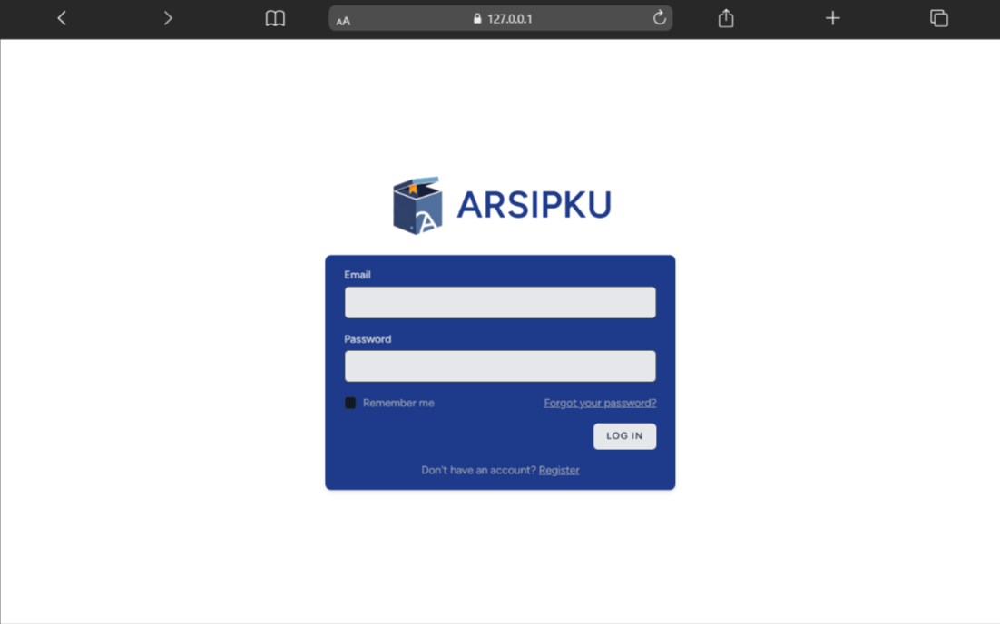
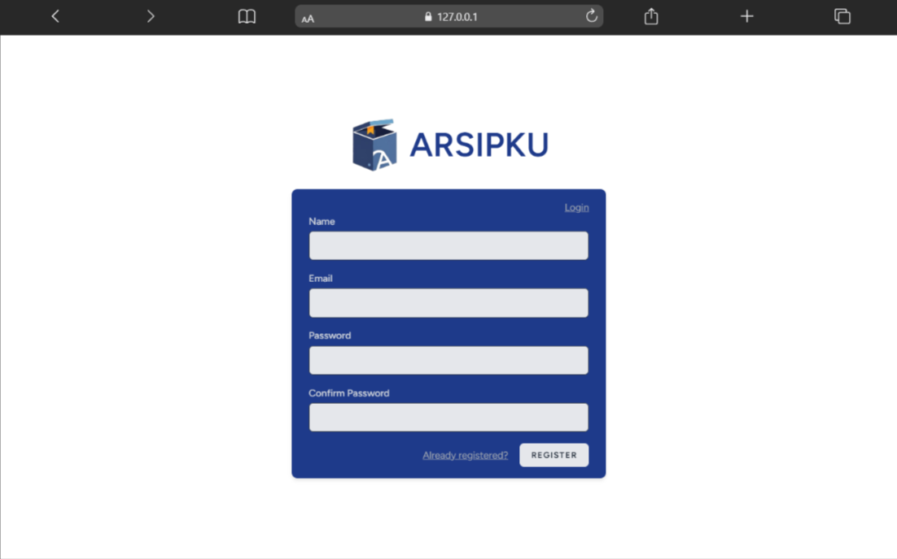
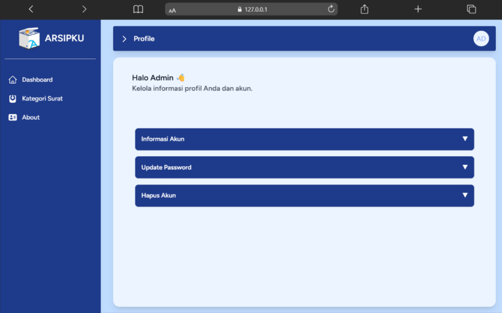

<p align="start" style="display: flex; align-items: center; gap: 10px;">
  
  <span style="font-size: 2rem; font-weight: bold;">ARSIPKU</span>
</p>

## 🎯 Tujuan

Aplikasi **Arsipku** dibuat untuk mempermudah pengelolaan arsip digital secara terstruktur, efisien, dan mudah diakses oleh pengguna.  
Dengan aplikasi ini, penyimpanan dokumen menjadi lebih rapi, aman, serta mudah dicari kembali saat dibutuhkan.👍

## ✨ Fitur

-   📝 Register dan login
-   📊 Dashboard ringkasan arsip
-   📁 Manajemen arsip surat (➕ tambah, ✏️ edit, 👁️ lihat, ❌ hapus)
-   📄 Unduh surat dalam format **.pdf**
-   📤 Export data arsip surat ke **.csv**
-   🔍 Pencarian arsip surat berdasarkan nama surat
-   🗂️ Manajemen kategori surat (➕ tambah, ✏️ edit, 👁️ lihat, ❌ hapus)
-   👤 Lihat informasi akun (profile)
-   🔑 Mengganti password
-   🗑️ Menghapus akun
-   🌟 Melihat Developer pada halaman about
-   🚪 Logout

## 🚀 Cara Menjalankan

1. ⬇️ Clone repository
    ```bash
    git clone https://github.com/trjgdyan/arsip-app.git
    ```
2. 📦 Install dependency menggunakan Composer dan NPM
    ```bash
    composer install
    npm install & npm run dev
    ```
3. ⚙️ Copy file `.env.example` menjadi `.env` dan sesuaikan konfigurasi database
    ```bash
    cp .env.example .env
    ```
4. 🔑 Generate application key
    ```bash
    php artisan key:generate
    ```
5. 🗃️ Jalankan migraasi database
    ```bash
    php artisan migrate
    ```
6. ▶️ Jalankan server lokal
    ```bash
    php artisan serve
    ```

## 📸 Screenshot

### 🔐 Halaman Login/Register
<p align="center">
  
  
</p>

---

### ✨ Halaman About
<p align="center">
  
  
</p>

---

### 🏠 Dashboard & Manajemen Arsip

#### 📊 Dashboard
<p align="center">
  
  
  
</p>

#### 📂 CRUD Arsip
<p align="center">
  
  
  
  
</p>

---

### 🗂️ Manajemen Kategori
<p align="center">
  
  
  
  
</p>

---

### 👤 Halaman Profile
<p align="center">
  
  
  
</p>
